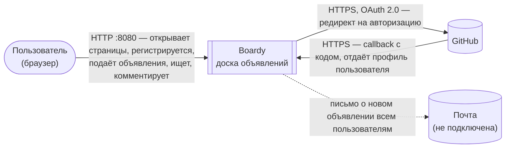
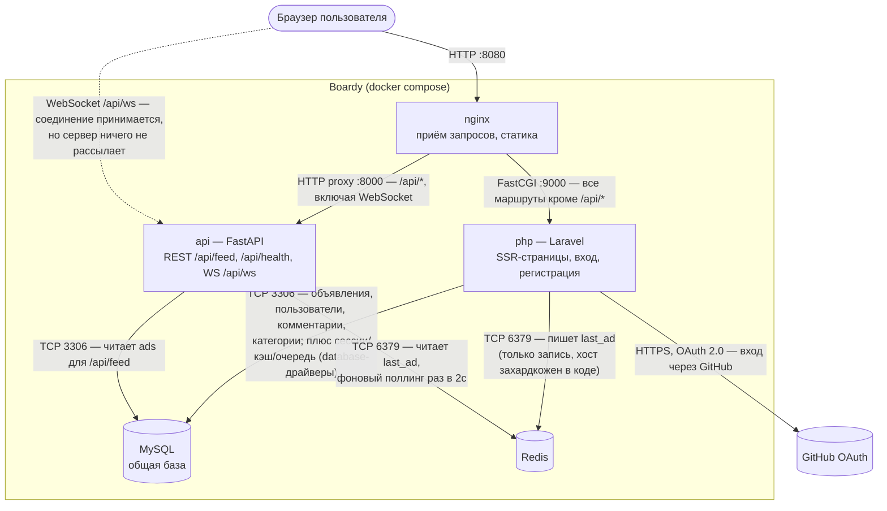

# Карта системы

## Схема 1. Контекст

```mermaid
graph LR
  User(["Пользователь<br/>(браузер)"])
  Boardy[["Boardy<br/>доска объявлений"]]
  GitHub[("GitHub")]
  Mail[("Почта<br/>(не подключена)")]

  User -->|"HTTP :8080 — открывает страницы, регистрируется,<br/>подаёт объявления, ищет, комментирует"| Boardy
  Boardy -->|"HTTPS, OAuth 2.0 — редирект на авторизацию"| GitHub
  GitHub -->|"HTTPS — callback с кодом, отдаёт профиль пользователя"| Boardy
  Boardy -.->|"письмо о новом объявлении всем пользователям"| Mail
```

## Схема 2. Контейнеры

```mermaid
graph TB
  Browser(["Браузер пользователя"])

  subgraph Boardy["Boardy (docker compose)"]
    Nginx["nginx<br/>приём запросов, статика"]
    Php["php — Laravel<br/>SSR-страницы, вход, регистрация"]
    Api["api — FastAPI<br/>REST /api/feed, /api/health, WS /api/ws"]
    Mysql[("MySQL<br/>общая база")]
    Redis[("Redis")]
  end

  GitHubExt[("GitHub OAuth")]

  Browser -->|"HTTP :8080"| Nginx
  Nginx -->|"FastCGI :9000 — все маршруты кроме /api/*"| Php
  Nginx -->|"HTTP proxy :8000 — /api/*, включая WebSocket"| Api

  Php -->|"TCP 3306 — объявления, пользователи, комментарии,<br/>категории; плюс сессии/кэш/очередь (database-драйверы)"| Mysql
  Php -->|"TCP 6379 — пишет last_ad<br/>(только запись, хост захардкожен в коде)"| Redis
  Php -->|"HTTPS, OAuth 2.0 — вход через GitHub"| GitHubExt

  Api -->|"TCP 3306 — читает ads для /api/feed"| Mysql
  Api -->|"TCP 6379 — читает last_ad,<br/>фоновый поллинг раз в 2с"| Redis
  Browser -.->|"WebSocket /api/ws — соединение принимается,<br/>но сервер ничего не рассылает"| Api
```

